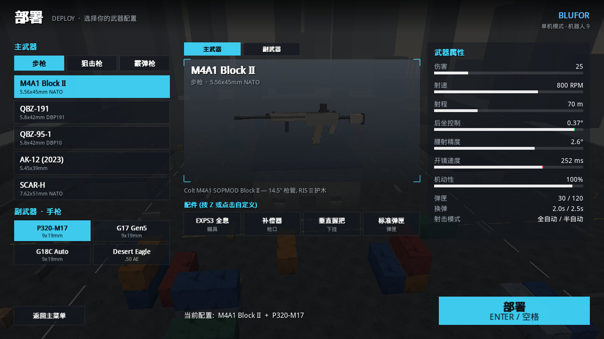

# PORTAL STRIKE 2042 — Python 战地风格 FPS

纯 Python（pygame + PyOpenGL + numpy）实现的第一人称射击游戏原型，参考 Battlefield 2042 的操作手感与界面风格。
**无需任何外部素材** —— 模型、纹理、音效全部程序化生成。



## 快速开始

```bash
pip install pygame PyOpenGL numpy
cd fps_game
python main.py                              # 主菜单 → 单人对战 (对抗 AI)
python -m net.server --port 27960 --bots 3  # 专用服务器 (无渲染)
python main.py --connect 127.0.0.1:27960    # 客户端直连
python tests/test_mechanics.py              # 无头测试 (动作系统 / 武器 / 预测确定性)
```

## 操作

| 按键 | 动作 | 说明 |
|---|---|---|
| WASD | 移动 | |
| Shift (按住) | 冲刺 | FOV 增大；武器进入战术冲刺姿态；冲刺→开火有延迟 |
| 空格 | 跳跃 / **翻越** | 面前 0.45–1.65 m 障碍自动翻越，空中贴墙也可以 |
| C / 左Ctrl | 半蹲 (切换) | **冲刺中按 C = 滑铲**；**长按 C = 趴下** |
| X | 趴下 / 起身 | 有过渡动作，期间不能开火；匍匐时武器下压、无法射击 |
| Q / E | 左 / 右侧身 | 带防穿墙限制 |
| 右键 / 左键 | 瞄准 / 射击 | 开镜 FOV 取决于瞄具倍率；≥3x 显示全屏镜片 |
| R | 换弹 | 战术换弹和空仓换弹动作不同；霰弹逐发装填，可开火打断 |
| 1 / 2 / 滚轮 | 切换主/副武器 | |
| B | 射击模式 | 全自动 / 半自动 / 点射 |
| T | 检视武器 | |
| **Z** | **配件菜单** | BF2042 Plus 系统：上=瞄具，左=枪口，右=下挂，下=弹匣 |
| Tab / Esc / F1 | 计分板 / 暂停 / 帮助 | |

## 武器 (基于现实枪械改造)

| 类别 | 武器 |
|---|---|
| 手枪 (副武器) | **P320-M17**、**G17 Gen5**、G18C 全自动、沙漠之鹰 .50AE |
| 步枪 | **M4A1 Block II**、**QBZ-191**、**QBZ-95-1** (无托)、AK-12 (2 连发)、SCAR-H |
| 狙击枪 | AWM .338 (栓动)、M82A1 巴雷特、QBU-88 (无托 DMR)、SVD |
| 霰弹枪 | M870 (泵动)、SPAS-12 (泵动/半自动)、Saiga-12K (弹匣)、QBS-09 |

配件 (共 25 种)：机瞄 / RMR / T2 红点 / EXPS3 全息 / 3x / ACOG 4x / 8x / 12x；消音器 / 补偿器 / 消焰器 / 制退器 / 收束器 / 独头弹；
垂直握把 / 斜握把 / 激光 / 两脚架；标准 / 扩容 / 快拔 / 弹鼓 / 穿甲弹。配件真实修改属性，并改变 3D 模型。

每次重生都会进入**部署界面**，自由选择一把主武器 + 一把副武器，配件配置会本地保存。

---

## 架构 (为多人模式设计)

```
            ┌──────────────── 客户端 (client/, render/, ui/) ────────────────┐
  键鼠 ──▶  InputSampler ──▶ InputCommand ──▶ GameSession ──▶ World 状态 ──▶ 渲染 / 动画 / HUD
            └──────────────────────────────────────┬─────────────────────────┘
                                                   │ 同一接口
                        ┌──────────────────────────┴───────────────────────────┐
                 LocalSession (单机)                                   NetworkSession (多人)
          进程内权威 World + BotManager                    本地预测 + 服务器校正 (重放未确认命令)
                                                                          │ UDP (JSON+zlib, 可替换)
                                                                    GameServer (net/server.py)
                                                           权威 World + BotManager, 无渲染依赖
```

### 核心原则

1. **模拟与渲染完全分离**
   `core/ weapons/ player/ world/ net/` 不 import pygame / OpenGL，可直接在无显卡的 Linux 服务器上运行。
2. **唯一输入通道：`InputCommand`**
   真人、远程玩家、AI 机器人全部通过 `InputCommand` 驱动同一个 `simulate_player()`。机器人天然可以跑在服务器上。
3. **确定性模拟**
   固定 60Hz tick；武器散布 / 后坐使用 `hash_rand(pid, shot_counter)` 确定性随机 ——
   客户端预测与服务器结果**逐 tick 完全一致**（见 `test_prediction_matches_server`）。
4. **状态全部可序列化**
   `PlayerState.to_dict()` / `WeaponInstance.to_dict()` 即网络快照；动画系统只"读取"状态
   （例如 `weapon.state/progress/phase`、`land_counter`、`shot_counter`），因此远程玩家的动作表现与本地一致。
5. **事件驱动表现层**
   World 产出 `shot / hit / kill / spawn` 等 JSON 事件 → 客户端据此播放音效、曳光弹、弹孔、命中反馈、击杀信息。

### 目录

```
core/       settings (全部参数) · commands (InputCommand/按键位) · mathutil (确定性随机)
weapons/    definitions (17 把武器数据) · attachments (配件与属性计算) · weapon_state (武器状态机)
player/     player_state (可序列化状态) · controller (动作系统: 冲刺/滑铲/半蹲/趴下/翻越/侧身/开镜)
world/      collision (AABB+网格+射线) · map_data (港口地图) · world (命中判定/伤害/重生/比分) · bots (导航图+AI)
net/        protocol · transport (Loopback/UDP) · session (LocalSession) · net_session (预测客户端) · server
render/     gl_util · gun_models (程序化枪械,可动部件) · viewmodel (第一人称动画) · camera · world_renderer
ui/         widgets · hud · menus (主菜单/部署/Plus 配件菜单/暂停)
client/     app (主循环) · input · audio (程序化音效) · prefs
tests/      test_mechanics.py
```

### 动作 / 动画系统

每个动作在模拟层都有独立的状态和计时器（`player/controller.py`），渲染层（`render/viewmodel.py`、`render/camera.py`）为每个动作设计了专属动画：

| 动作 | 模拟层 | 第一人称武器 | 镜头 |
|---|---|---|---|
| 开镜 | 按武器开镜时间推进 `ads` | 瞄具严格对准屏幕中心，晃动抑制 | FOV 按倍率缩放 |
| 冲刺 | 速度↑、横移受限、冲刺→开火延迟 | 枪口斜压胸前 + 8 字摆动 | FOV +6，晃动增大 |
| 滑铲 | 冲量 + 摩擦衰减 + 轻微转向，可滑铲跳 | 枪身侧倾 20° | 压低 + 侧倾 + FOV 冲击 |
| 半蹲 | 碰撞盒变矮，起身检测头顶 | 枪身内收倾斜 | 眼高平滑过渡 |
| 趴下 | 过渡时间、俯仰限制、匍匐禁射 | 匍匐时武器下压并左右摆动 | 贴地 + 左右摇摆 |
| 翻越 | 抛物线插值 (先抬升后前推) | 武器侧翻让开 | 俯仰下沉 + 侧倾 |
| 跳跃 / 落地 | `jump_counter` / `land_counter` | 随竖直速度滞后 / 落地弹簧 | 落地下沉弹簧 |
| 侧身 | 眼睛偏移 + 防穿墙 | — | 横移 + 13° 翻滚 |
| 换弹 | 战术 / 空仓 / 逐发 三种状态机 | 弹匣拔出-插入、拉机柄、左手 IK 跟随 | — |
| 拉栓 / 泵动 | `cycle` 状态 | 右手 IK 拉栓 / 左手带动护木；拉栓时短暂离开瞄具 | — |
| 射击 | 后坐力偏移 + 恢复 | 后坐弹簧、套筒/枪机后坐、枪口火焰 | 轻微抖动 |

手臂使用双骨骼 IK 从固定的肩膀连接到手部位置，所以只需要为"手"写关键帧。

### 扩展指南

- **添加武器**：在 `weapons/definitions.py` 中 `_reg(WeaponDef(...))`，`model` 参数决定程序化外观 (kind/barrel/stock/mag...)
- **添加配件**：在 `weapons/attachments.py` 中 `_a(AttachmentDef(...))`，`mods` 为乘法修正；外观在 `render/gun_models.py`
- **新地图**：写一个返回 `MapData` 的构建函数传给 `World(map_builder=...)`
- **新游戏模式**：扩展 `World.step()` / `_kill()` (目前为团队死斗)

### 多人模式路线图 (接口已预留)

- [x] 客户端/服务器分离、权威服务器、客户端预测 + 回滚重放
- [x] 冗余输入包 (每包带最近 3 条命令) / 事件带 id 重复发送去重
- [x] 服务器端校验 (配件合法性 `sanitize`、配置 `validate_loadout`)
- [ ] 延迟补偿 (保存历史命中盒, 按 RTT 回溯) —— 在 `World._resolve_shot` 接入
- [ ] 远程玩家快照插值缓冲 (目前是指数平滑)
- [ ] 增量快照 / 二进制协议 (替换 `net/protocol.py` 的 encode/decode 即可)
- [ ] 可靠消息通道、大厅、匹配
